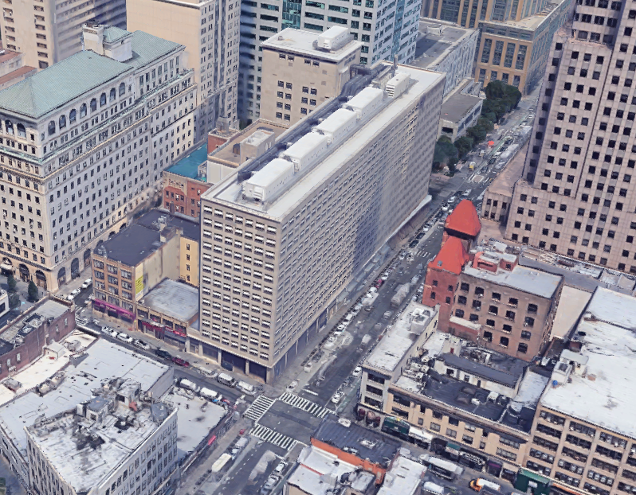

# Bio

One side of my brain feels most at home with data and programming while the other side likes working with teams, organizing projects, and putting on events. Here's how the two came about...
 
 
## The data half

Between 2013 and 2018, I worked in the legal-investigative world as an analyst. I started out at the [Manhattan DA's Office](https://www.manhattanda.org/district-attorney-vance-announces-expansion-anti-corruption-unit/) investigating city officials suspected of criminal activity. Then I moved over to a small [PI firm](https://www.questinvestigates.com/) as an investigator where we did background checks, interviewed witnesses, and read lots of court cases. Finally, I moved back to the public sector as an auditor for the [NYC Campaign Finance Board](https://www.nyccfb.info/).

During that last one (auditing), I started to make the switch from qualitative to quantitative analysis. In my spare time, I learned Python and SQL before deciding to go full time at an applied data science masters program at [NYU](https://cusp.nyu.edu/) in Summer 2018. 

Our program focused on the intersection between urban planning and open data (aka how can we use data to understand/improve cities?), which helped me transition to [Topos](https://topos.com/), a Brooklyn-based startup where we used data to understand cities and shared our insights with retail chains looking to expand. I was a data engineer at Topos and you can find out more about my work with them <a href="./projects">here</a>.

In sum, I'm an analyst who likes data of all kinds and that's what's been tugging me along this path over the past 7 years.
 
 
## The organizational half

I've played tennis all my life and have been playing in Brooklyn at Fort Greene Park since I moved from North Carolina to NYC in 2012. In 2015, I became a board member at a non-profit called the [Fort Greene Tennis Association](http://www.fortgreenetennis.org/), which, you guessed it, manages all things tennis at Fort Greene Park. 

Since I became a board member, I've learned how to plan and execute projects while working with a team of volunteers from the community. I've spearheaded a fundraising drive in which we raised $70k and resurfaced all 6 tennis courts in 2019, collected and analyzed data to create <a href="./data-and-tennis">maps and analytical insights</a>, and helped to put on events for hundreds of people.

 
 
## A couple other stories

Prior to data analysis and non-profit work, I lived a few different lives: I taught English in China for a year, harvested vegetables on a farm in Vermont for a season, drove a delivery truck for an UWS bakery (the one with the very, very large cookies), and taught tennis on a roof in Chelsea.

Glad I did it. Glad I'm not doing it now.