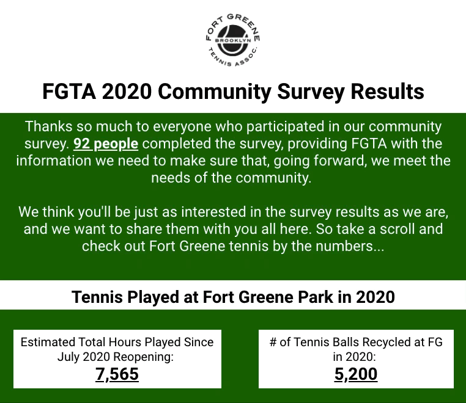

# Data + tennis

I've come up with self-directed projects combining tennis and data to help with my work as a board member at the [Fort Greene Tennis Association](http://www.fortgreenetennis.org/), as part of an entrepreneurial project my friend and I started, and out of general curiosity. 
<br>
<br>
## FGTA and NYC tennis

Since the onset of COVID-19, tennis has seen a [significant increase in participation](https://www.pbs.org/newshour/show/how-has-covid-9-impacted-tennis) across the US. That has been especially true at Fort Greene Park, where we had lines of 50+ people starting each morning at around 6:30am. 

We've seen more and more players coming out to Fort Greene for years, but I wanted to get some hard numbers to back up these observations. So I started collecting data from the courts, created a survey, and summarized the results in a tidy little [Data Studio report](https://datastudio.google.com/u/0/reporting/6520be9f-9cab-4426-8896-2ac97b74b574/page/hZ4vB) (our data collection and research is ongoing):
<div class="w3-container">
  
  <div id="modal02" class="w3-modal" onclick="this.style.display='none'">
    <span class="w3-button w3-hover-yellow w3-xlarge w3-display-topright">X</span>
    <div class="w3-modal-content w3-animate-zoom">
      
    </div>
  </div>
</div>
<br>
<br>
To try and help distribute the demand for court time, I decided to make a map of tennis courts to help people find more places to play. So with a little Python, some NYC Open Data, and a dash of Google Maps results, we came up with [a map](http://www.fortgreenetennis.org/nyc-courts) of public and private tennis courts in NYC along with handball walls (they're great for practice!):

<div class="w3-container">
  
  <div id="modal01" class="w3-modal" onclick="this.style.display='none'">
    <span class="w3-button w3-hover-yellow w3-xlarge w3-display-topright">X</span>
    <div class="w3-modal-content w3-animate-zoom">
      
    </div>
  </div>
</div>
<br>
<br>
## Bageled NYC

I'm working with a creative partner on producing bagel-themed grips for tennis rackets (in tennis, a score of 6-0 is also called a "bagel"). To showcase our product, I created [our website](https://www.bageled.nyc/), which includes a cloud-based Python script for scraping scores from pro tennis matches across the globe and a fun leaderboard showing which pro players have the most bagels (updated hourly):

```python
def score_analyzer():
    # Iterate through pro matches
    for match in api_json["results"]:                
            # Save the match score as a string
            match_score = ""
            set_scores = match["sport_event_status"]["period_scores"]
            # Iterate through sets in the match
            for set_score in set_scores:                
                    match_score += str(set_score["home_score"]) + \
                    " - " + str(set_score["away_score"]) + " "
```
<br>
<iframe width="768" height="850" src="https://datastudio.google.com/embed/reporting/02761227-2cfd-48d6-91e4-5b261788ef62/page/04osB" frameborder="0" style="border: 3px solid black; width: 768px; height: 850px;" allowfullscreen=""></iframe>
<br>
<br>
<div class="w3-container">
  
  <div id="modal04" class="w3-modal" onclick="this.style.display='none'">
    <span class="w3-button w3-hover-yellow w3-xlarge w3-display-topright">X</span>
    <div class="w3-modal-content w3-animate-zoom">
      
    </div>
  </div>
</div>
<br>
I'm looking forward to working on this project more.
<br>
<br>
## ATP tennis

I'm also generally curious to know more about life on the ATP tour, especially when it comes to the financial aspects of that lifestyle. To figure out which players are making bank, who's breaking even, and who's in the red, I found prize money data from 2019 in PDF format, transformed thousands of those PDF pages into a table using Python, and analyzed the data using SQL. Here are a couple early findings:
<br>
<br>
### Weekly earnings

<div class="w3-container">
  
  <div id="modal05" class="w3-modal" onclick="this.style.display='none'">
    <span class="w3-button w3-hover-yellow w3-xlarge w3-display-topright">X</span>
    <div class="w3-modal-content w3-animate-zoom">
      
    </div>
  </div>
</div>
<br>
Pictured above are the weekly earnings for different groups of ranked players. My analysis showed that players in the top 20 did, in fact, make bank in 2019. But then weekly earnings drop off a cliff, which is a problem for the lower ranks since it apparently costs around $3k per week just to compete on the tour.
<br>
<br>
### Total prize money pot
<div class="w3-container">
  
  <div id="modal06" class="w3-modal" onclick="this.style.display='none'">
    <span class="w3-button w3-hover-yellow w3-xlarge w3-display-topright">X</span>
    <div class="w3-modal-content w3-animate-zoom">
      
    </div>
  </div>
</div>
<br>
This is a snapshot of which players took home the most money out of the pot of total prize money in 2019.
That year, there was $230,506,600 in total prize money up for grabs. So we're seeing that ATP players in the top 100 captured 78% of that prize money while the other 22% was divided up among 400+ players.

[Reach out](./contact.md) if you've got suggestions or wanna collaborate.