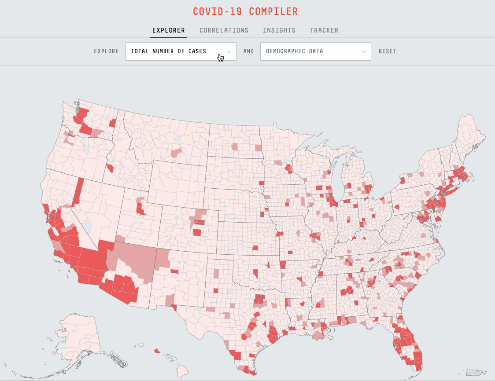

<!-- <link rel="shortcut icon" type="image/x-icon" href="assets/images/icon.ico"> -->

# Projects

I'm a data engineer living in Brooklyn, NY and I like Python, SQL, and maps (plus the occassional web development - like this website, for example). [These are some of my projects](./projects.md). 
 
 
I'm also a tennis player and community organizer and have found ways to combine tennis & data. More on those projects [here](./projects-tennis.md).

# About

Like I said, I'm a big tennis fan. I'm also a board member at a non-profit where we manage the public tennis courts at Fort Greene Park in Brooklyn, NY. I explain that plus all the other non-code stuff [here](./story.md).