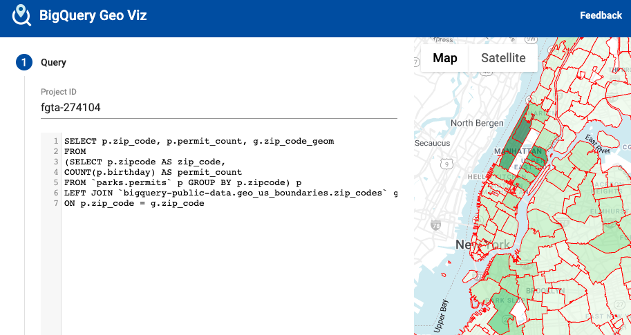
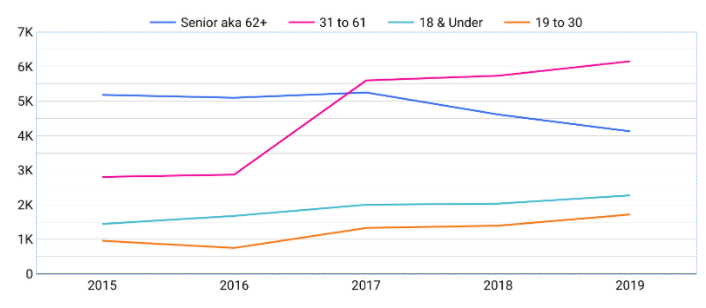
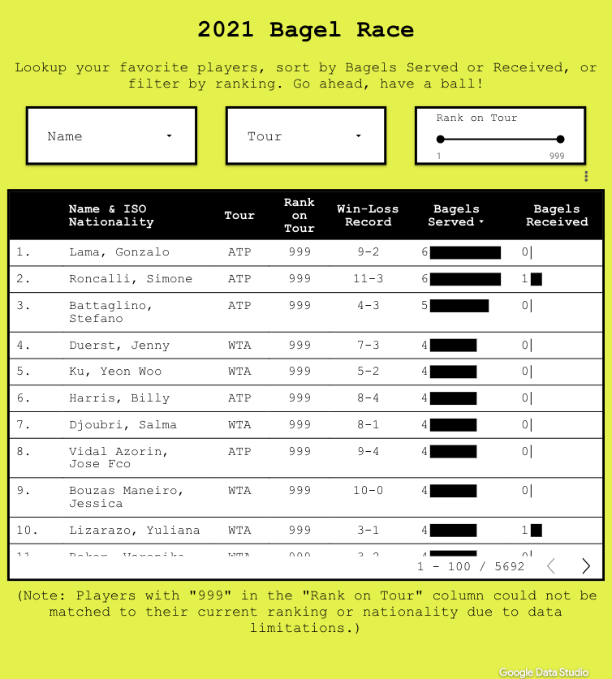
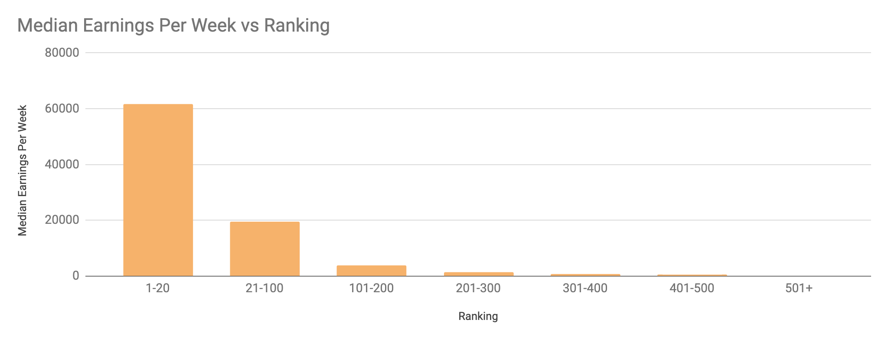
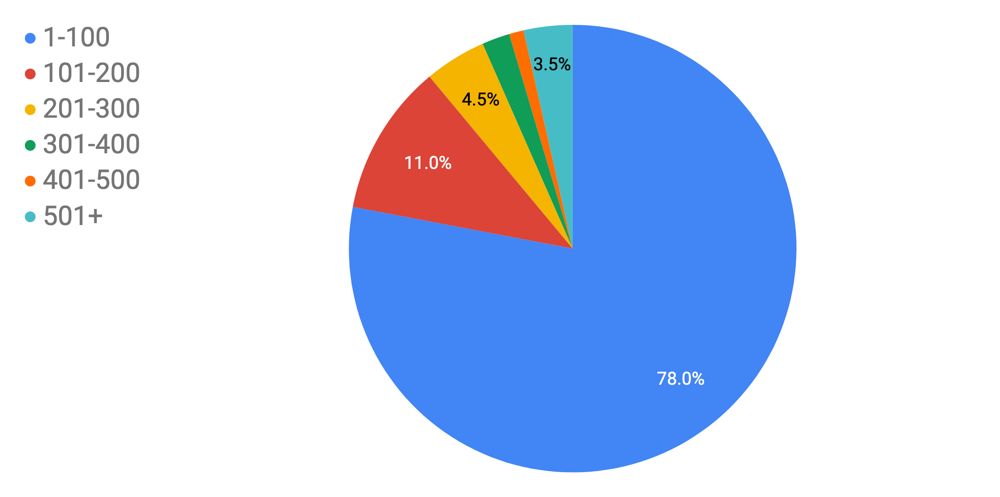

<a href = "assets/images/tennis-map.gif"></a>

# Data + tennis

I've done side projects combining tennis and data as part of my work as a board member at the [Fort Greene Tennis Association](http://www.fortgreenetennis.org/), as a product-based side project, and just out of curiosity. 

### FGTA and NYC Tennis

I've come up with self-directed projects involving tennis and data during my time at the Fort Greene Tennis Association. The map above shows all the handball walls and public tennis courts in NYC, which I downloaded from NYC Open Data and prepared for mapping.

I've also analyzed tennis permit sales by NYC zip code using data I FOIA requested from the NYC Parks Department:

<a href = "assets/images/geo-viz.png"></a>

And this chart visualizing trends in permit purchases among different age groups:

<a href = "assets/images/permits-age.png"></a>

The point of all of this work is to understand the degree to which tennis is growing in NYC and where. The work is ongoing.

### Bageled NYC

I'm working with a creative partner on bagel-themed grips for tennis rackets (in tennis, a score of 6-0 is also called a "bagel"). I put together [our website](https://www.bageled.nyc/), which includes a cloud-based Python script for scraping scores from pro tennis matches across the globe:

```python
def score_analyzer():
    # Iterate through pro matches
    for match in api_json["results"]:                
            # Save the match score as a string
            match_score = ""
            set_scores = match["sport_event_status"]["period_scores"]
            # Iterate through sets in the match
            for set_score in set_scores:                
                    match_score += str(set_score["home_score"]) + \
                    " - " + str(set_score["away_score"]) + " "
```

<a href = "assets/images/bageled.png"></a>

Looking forward to working on this project more.

### ATP tennis

And I've taken a look at earnings on the ATP Tour to understand which players are making bank, who's breaking even, and who's in the red (since life on the pro tour is apparently rather expensive). This project involved transforming thousands of pages of PDFs into a table using Python and then some analysis in SQL. Here's what I found out about weekly earnings on the Tour:

<a href = "assets/images/ranking-groups.png"></a>

Players in the top 20 did, in fact, make bank in 2019. And then weekly earnings drop off a cliff, which is a problem for the lower ranks since it apparently costs around $3k per week just to compete on the tour.

And here's a snapshot of which players took home the most money out of the prize money pot in the same year:

<a href = "assets/images/pie-earnings.png"></a>

In 2019, there was $230,506,600 in total prize money up for grabs. So we're seeing that ATP players in the top 100 captured 78% of that prize money while the other 22% was divided up among 400+ players.

[Reach out](./contact.md) if you've got suggestions or wanna collaborate.