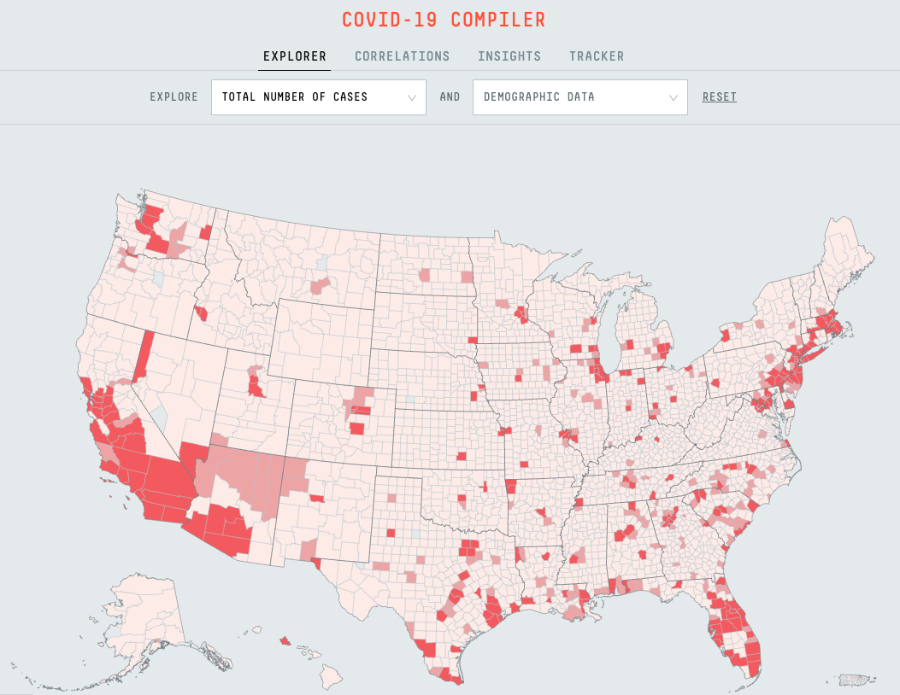
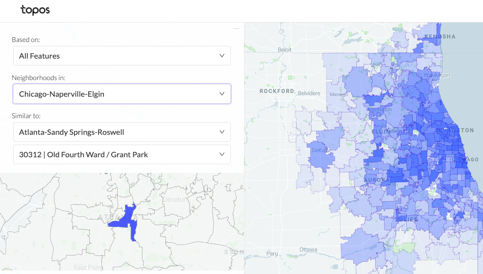
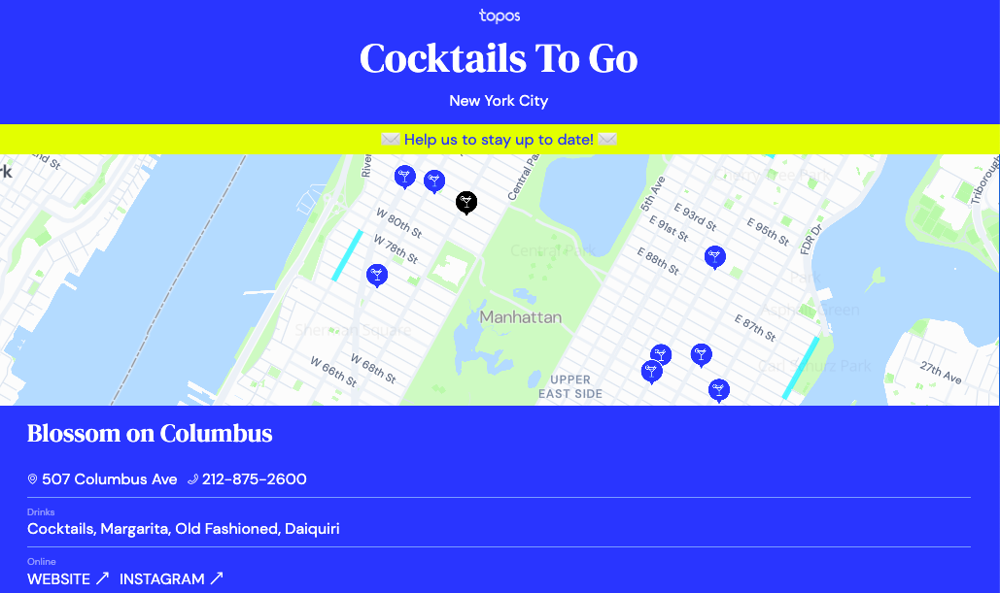

# Data engineering

Up until September 2020, I was a data engineer at a Brooklyn-based startup called [Topos](https://topos.com/), where we specialized in making maps like the one above, which is a [COVID-19 tracker](https://covid19.topos.com/) that we built in Spring 2020. 

We made maps to help owners of small retail chains find the best neighborhood to expand into:

And maps for New Yorkers looking for [a place to get a drink outside](https://cocktails.topos.com/):

To create these maps and our algorithmic recommendations for retail chains, we worked with all kinds of data: demographic stats from the US Census, business metadata, vehicular traffic counts, restaurant reviews, and a lot more. My job as a data engineer was to collect all the data, clean it, and generate new metrics for our data science and front end teams.

# Data analysis

When I wasn't transforming large data sets at Topos, I did my own analysis on topics like [trends in job postings nationwide](https://twitter.com/topos_ai/status/1258184297732849666) following the onset of COVID-19. Or looking at communities in the American Southwest that are particularly vulnerable to [public health crises](https://medium.com/topos-ai/high-covid-19-vulnerability-seen-in-and-near-navajo-nation-and-hopi-reservation-in-arizona-edba321699cb):

# Data science

But before Topos, I cut my teeth with data engineering, mapping, and analysis at NYU in an [applied data science program](https://cusp.nyu.edu/). Projects included: 
* [Anomaly detection](https://github.com/seeess1/machineLearning/blob/master/anomalies_traffic_health.ipynb) in traffic data
* Analyzing the relationship between [bars and 311 complaints](https://github.com/seeess1/publicDrunkenness/blob/master/public_drunkenness.ipynb)
* [Using computer vision](https://github.com/seeess1/pedestrian_cv) to count pedestrians at an intersection on campus:

Plus exercises in [streaming big data](https://github.com/seeess1/bigData) and more [machine learning](https://github.com/seeess1/machineLearning).

# One more thing

Every now and then I find a way to combine programming with my interest in tennis and I've got a few related projects, including [this website I created](https://www.bageled.nyc/) and this [map of tennis and handball courts in NYC](http://www.fortgreenetennis.org/nyc-courts). If you're particularly interested in my work with data & tennis, there's more of that [in here](./projects-tennis.md).
