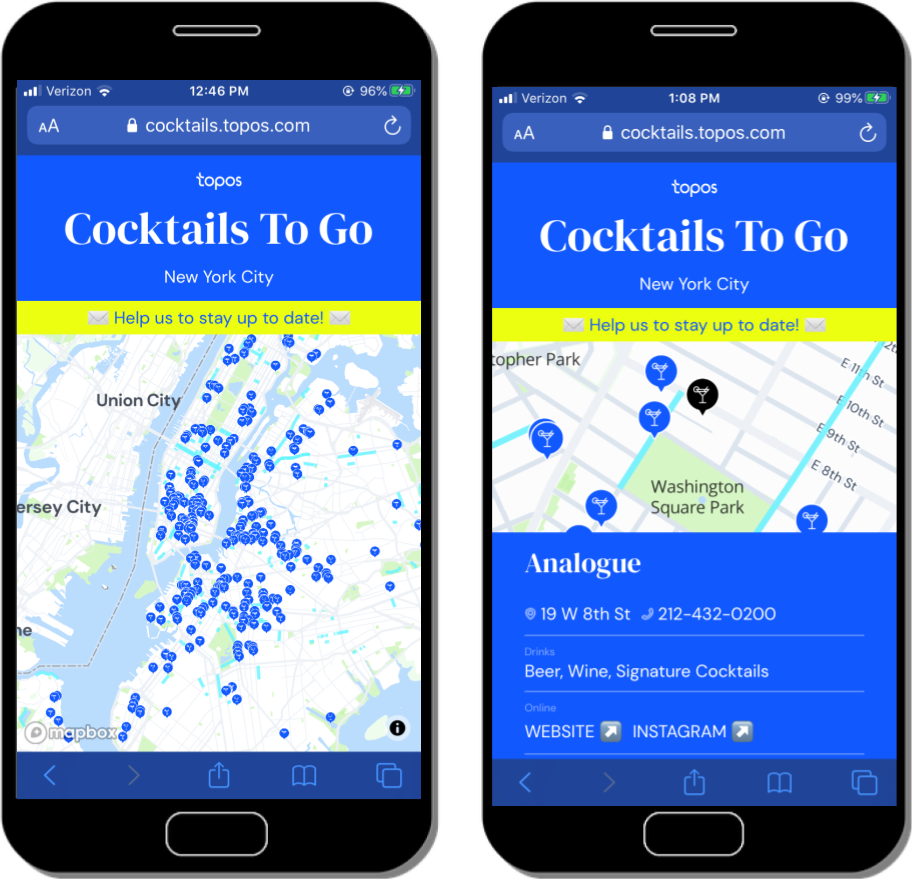
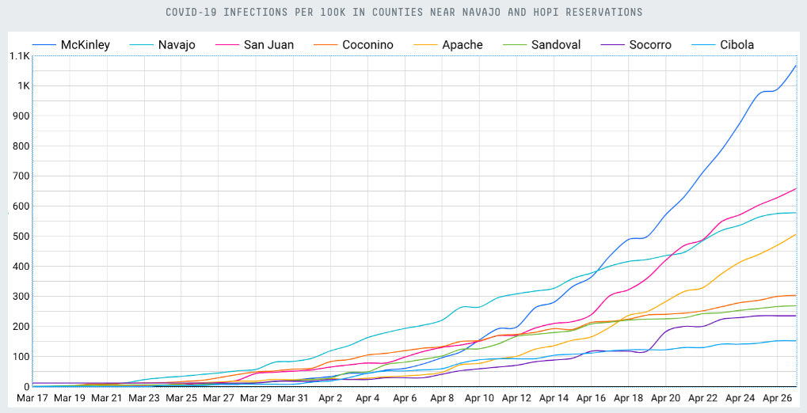

<h1>Data engineering</h1>

I'm just getting started in a new data engineering role at [Earnest Research](https://www.earnestresearch.com/), where we're using tools like Airflow and dbt and working with big data across multiple sectors, including retail and healthcare.
 
 
But prior to Earnest, I was a data engineer at a Brooklyn-based startup called [Topos](https://topos.com/), where we specialized in making maps. 
 
 
To make our maps, we needed lots of data: demographic stats from the Census, business metadata, vehicular traffic counts, restaurant reviews, and much more. The data I collected, cleaned, and transformed served as the backbone for our applications, including...
 
 
<h2>COVID-19 Compiler</h2>
In Spring 2020 we built a [COVID-19 tracker](https://covid19.topos.com/), which lets users explore different ways to measure COVID-19 cases in the US:

  
  

    X
    

      
    

  

 

It also lets users layer demographic stats (like population, unemployment numbers, and housing density) on top of case counts to look for interesting overlaps:

  
  

    X
    

      
    

  

 
 
 
## Retail

We helped retailers decide how to grow their business by making maps like this one, which finds similar neighborhoods across cities based on machine learning models:

  
  

    X
    

      
    

  

 
 
 
## Cocktails To Go

And we even made maps for New Yorkers looking for [a place to get a drink outside](https://cocktails.topos.com/):

  
  

    X
    

      
    

  

 
 
 
## Personal Projects

I like learning by doing, so I'm working on new projects just for fun, like [this data pipeline I set up](https://github.com/seeess1/twitter) for streaming in tweets with specific phrases or hashtags

  
  

    X
    

      
    

  

 
 
 
# Data analysis

When I wasn't transforming large data sets, I did my own analysis for Topos on topics like [trends in job postings nationwide](https://twitter.com/topos_ai/status/1258184297732849666) following the onset of COVID-19. Or looking at communities in the American Southwest that are particularly vulnerable to [public health crises](https://medium.com/topos-ai/high-covid-19-vulnerability-seen-in-and-near-navajo-nation-and-hopi-reservation-in-arizona-edba321699cb):

  
  

    X
    

      
    

  

 
 
 
# Data science

And before joining Topos, I cut my teeth with data engineering, mapping, and analysis at NYU in an [applied data science program](https://cusp.nyu.edu/). My projects included: 
* [Anomaly detection](https://github.com/seeess1/machineLearning/blob/master/anomalies_traffic_health.ipynb) in traffic data
* Analyzing the relationship between [bars and 311 complaints](https://github.com/seeess1/publicDrunkenness/blob/master/public_drunkenness.ipynb)
* [LiDAR mapping](https://sketchfab.com/3d-models/nyu-cusp-lidar-exercise-a5b41ceffb5f47f8a9c11123de2f20ea)
* [Using computer vision](https://github.com/seeess1/pedestrian_cv) to count pedestrians at an intersection on campus:
 

  
  

    X
    

      
    

  

 

Plus exercises in [streaming big data](https://github.com/seeess1/bigData) and more [machine learning](https://github.com/seeess1/machineLearning).
 
 
# Data + tennis

I also look for projects that combine programming with my non-profit work and general interest in tennis. You can learn more about these projects <a href="./data-and-tennis">here</a>.