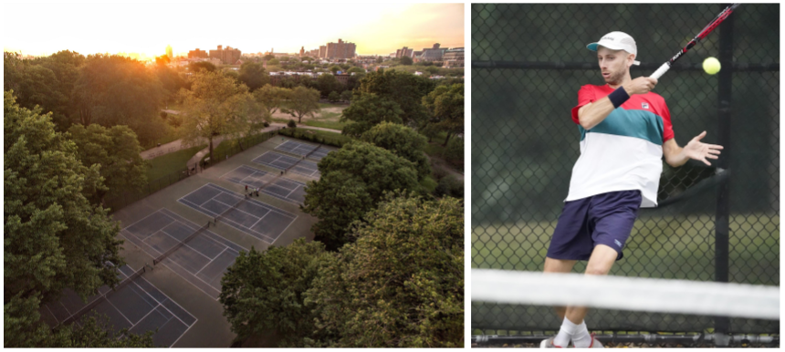

# Two halves

There's an analyst half of my brain that feels most at home with data and programming. The other half, meanwhile, enjoys working with teams, organizing projects, and putting on events. This is how they work together...

## The analyst half

Between 2013 and 2018, my career revolved around analyzing qualitative data in the legal-investigative world. I started out as an analyst at the [Manhattan DA's Office](https://www.manhattanda.org/district-attorney-vance-announces-expansion-anti-corruption-unit/) investigating city officials suspected of criminal activity. Then I moved over to the private sector as an investigator for a small [PI firm](https://www.questinvestigates.com/) where we did background checks, interviewed witnesses, and read lots of court cases. Finally, I moved back to the public sector as an auditor for the [NYC Campaign Finance Board](https://www.nyccfb.info/).

During that last one (auditing), I started to make the switch from qualitative to quantitative analysis. In my spare time, I learned basic Python and SQL until I decided to get serious and go full time. So I enrolled in an applied data science masters program at [NYU](https://cusp.nyu.edu/) in the summer of 2018. 

Our program focused on the intersection between urban planning and open data (aka how can we use data to understand/improve cities?), which helped me transition to [Topos](https://topos.com/), a Brooklyn-based startup that used data to understand cities and share our insights with retail chains looking to expand. I was a data engineer at Topos and you can find out more about my work with them at [this link](./projects.md).

In sum, I'm an analyst who likes data of all kinds and that's what's been tugging me along this path over the past 7 years.
 
 
## The organizational half

I've played tennis all my life and have been playing in Brooklyn at Fort Greene Park since 2012. In 2015, I became a board member at a non-profit called the [Fort Greene Tennis Association](http://www.fortgreenetennis.org/), which (you guessed it) manages all things tennis at Fort Greene Park. We've done things like raise $70k to resurface the courts in 2019, put on events for hundreds of people, manage a mailing list of 1k+ rabid tennis fans, plus some [data analysis](./projects-tennis.md).

This is the team/project organization side of my brain.

 
 
## Last thing

Prior to data analysis and non-profit work, I lived a few different lives: I taught English in China for a year, harvested vegetables on a farm in Vermont for a season, drove a delivery truck for an UWS bakery (the one with the very, very large cookies), and taught tennis on a roof in Chelsea.

Glad I did it. Glad I'm not doing it now.